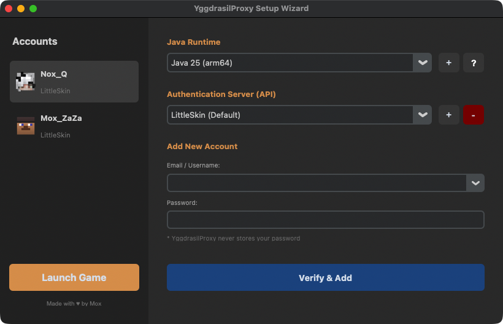

# YggdrasilProxy

🌍 English | [简体中文](./README.zh_CN.md)

---

YggdrasilProxy is a **launcher middleware tool** for Minecraft,  
designed to centrally manage **third-party authentication, servers, and Java runtimes**,  
without replacing or modifying your existing launcher.

It works with **HMCL, Prism Launcher, PCL2, the official Minecraft Launcher**, and **almost all** other launchers.



---

## ✨ What can this tool do?

- Manage multiple Yggdrasil authentication accounts  
- Bind accounts to different Minecraft instances  
- Automatically inject authlib-injector at launch  
- Adapt to different launcher parameter formats  
- Select or bind Java runtimes per instance  
- Optionally bundle Java for environment-free launching  

---

## 🚀 Quick Start Guide

### 1️⃣ Download

Go to the **Releases** page and choose the version that suits you:

- **Standard Edition**: Uses an existing system Java environment  
- **Java Edition**: Bundles Java, ready to use out of the box  

### 2️⃣ Use with your launcher

- Set **YggdrasilProxy** as the game Java executable
- Add the launch parameter ```--yggpro``` in your launcher to force the login page to open.

### 3️⃣ First-time setup

On first launch, a configuration window will appear:

1. Add or select an account  
2. Select an authentication server (LittleSkin included by default)  
3. Choose a Java runtime  
4. Click “Launch Game” to proceed. All settings are saved per instance automatically.

### 4️⃣ Features
- Double-click the application to open compatibility settings  
- Right-click the `?` icon to switch the interface language
- Right-click an account to copy its UUID

---

## 🧩 Supported Launchers

- HMCL  
- Prism Launcher  
- MultiMC  
- Official Minecraft Launcher  
- Almost all launchers!

---

## ⚠️ Security Notes

- Does not modify your game files  
- Does not record or store your password  
- Access tokens are stored locally in encrypted form  
- Network requests are limited to the selected authentication server  

---

## 📦 Build

#### Pseudocode, see [pyCMD](pyCMD.md) for details

```bash
pyinstaller -F
  --collect-all cryptography
  # [Optional] YggProJAVA.zip is the Java package you want to bundle
  --add-data "assets/YggProJAVA.zip:assets"
  --add-data "assets/fMcMain.jar:assets"
  --add-data "assets/authlib-injector.jar:assets"
  # [Compatibility] Optional, for compatibility with some Windows launchers 
  --add-data "assets\javaw.exe;assets"
  --add-data "assets\javac.exe;assets"
  --name="YggdrasilProxy"
  run.py
```
This project uses authlib-injector, provided by [yushijinhun](https://github.com/yushijinhun/authlib-injector). Special thanks to the original author.

---

## 📄 License

- [[MPL-2.0]](LICENSE)
